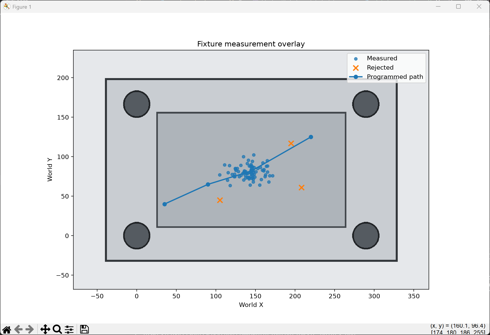
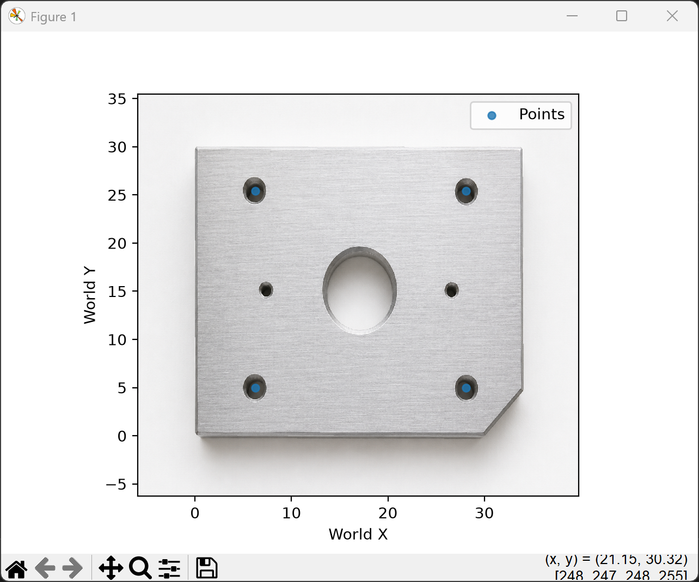
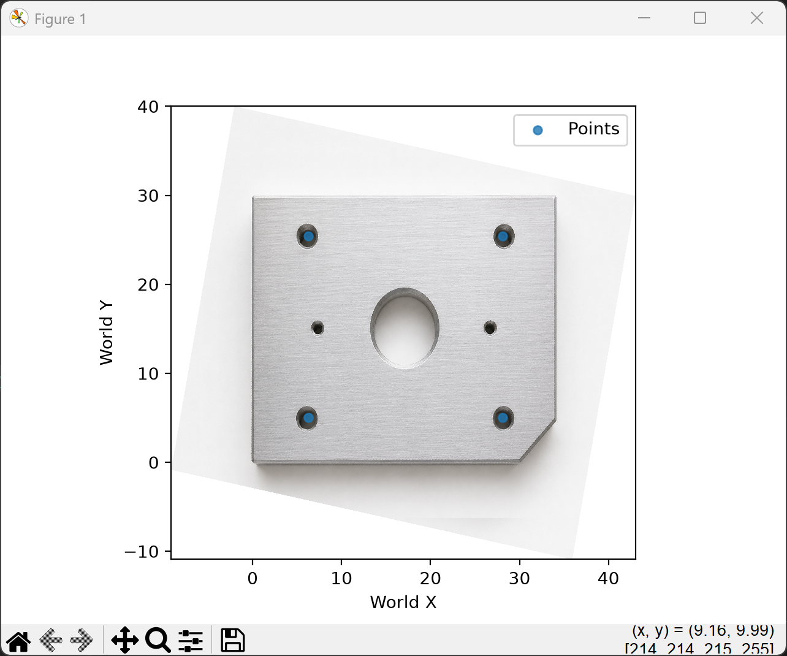
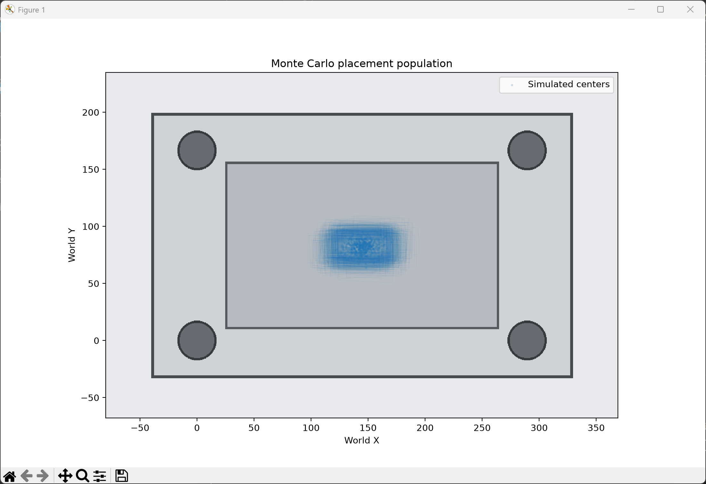

# imageplot

A Matplotlib-first Python library for plotting engineering data over PNG images using full 2D affine coordinate systems.

Coordinate systems can be loaded from PNG metadata or created programmatically.

## Overview

`imageplot` lets you:

- display data over a PNG image using a coordinate system,
- load coordinate systems from PNG metadata,
- define coordinate systems directly in Python,
- convert between world and pixel coordinates.

## Installation

Install the package in editable mode for local development:

```powershell
python -m pip install -e .
```

To install test and development tooling as well:

```powershell
python -m pip install -e ".[dev]"
```

The Excel example has optional dependencies:

```powershell
python -m pip install -e ".[excel]"
```

## Quick start

The most common workflow is to create a coordinate system and plot against an image.

```python
from imageplot import CoordinateSystem, ImagePlot

fixture = CoordinateSystem.from_points(
    name="Fixture",
    origin_pixel=(1250, 820),
    origin_world=(0.0, 0.0),
    x_point_pixel=(1750, 850),
    x_point_world=(100.0, 0.0),
    y_point_pixel=(1220, 320),
    y_point_world=(0.0, 100.0),
)

plot = ImagePlot("fixture.png", coordinate_system=fixture)
plot.scatter([(10, 15), (12, 18), (14, 17)], label="Measured")
plot.legend()
plot.show()
```

## Use an embedded coordinate system from PNG metadata

If your PNG already contains a coordinate system in its metadata, you can load it by name:

```python
from imageplot import ImagePlot

plot = ImagePlot("fixture.png", coordinate_system="Fixture")
plot.scatter([(10, 15), (12, 18), (14, 17)], label="Measured")
plot.legend()
plot.show()
```

## Create and save a coordinate system into PNG metadata

You can generate a coordinate system in Python and embed it into an image.

```python
from imageplot import CoordinateSystem, add_coordinate_system

fixture = CoordinateSystem.from_points(
    name="Fixture",
    origin_pixel=(1250, 820),
    origin_world=(0.0, 0.0),
    x_point_pixel=(1750, 850),
    x_point_world=(100.0, 0.0),
    y_point_pixel=(1220, 320),
    y_point_world=(0.0, 100.0),
)

add_coordinate_system("fixture.png", fixture)
```

The resulting `coordinate_systems_json` iTXt metadata is compatible with the PNG Coordinate System Metadata Editor.

To reject duplicate entries instead of replacing them:

```python
add_coordinate_system("fixture.png", fixture, replace=False)
```

## Load coordinate systems directly

```python
from imageplot import load_coordinate_systems

for system in load_coordinate_systems("fixture.png"):
    print(system.name, system.handedness)
```

## Coordinate conversions

The plotting object can convert between pixel and world coordinates:

```python
pixels = plot.world_to_pixel(world_points)
world = plot.pixel_to_world(pixel_points)
```

## Example scripts

The repository includes example scripts under the [examples](examples) directory for common usage patterns.

### Point and path overlays

[View the example script](examples/plot_demo_points.py).



### Plot points loaded from Excel

[View the example script](examples/plot_block_points_from_excel.py). The same
world-coordinate data remains aligned when the source image is rotated.

| Original image | Rotated image |
| --- | --- |
|  |  |

### Monte Carlo shape overlays

[View the example script](examples/monte_carlo_shapes.py).



